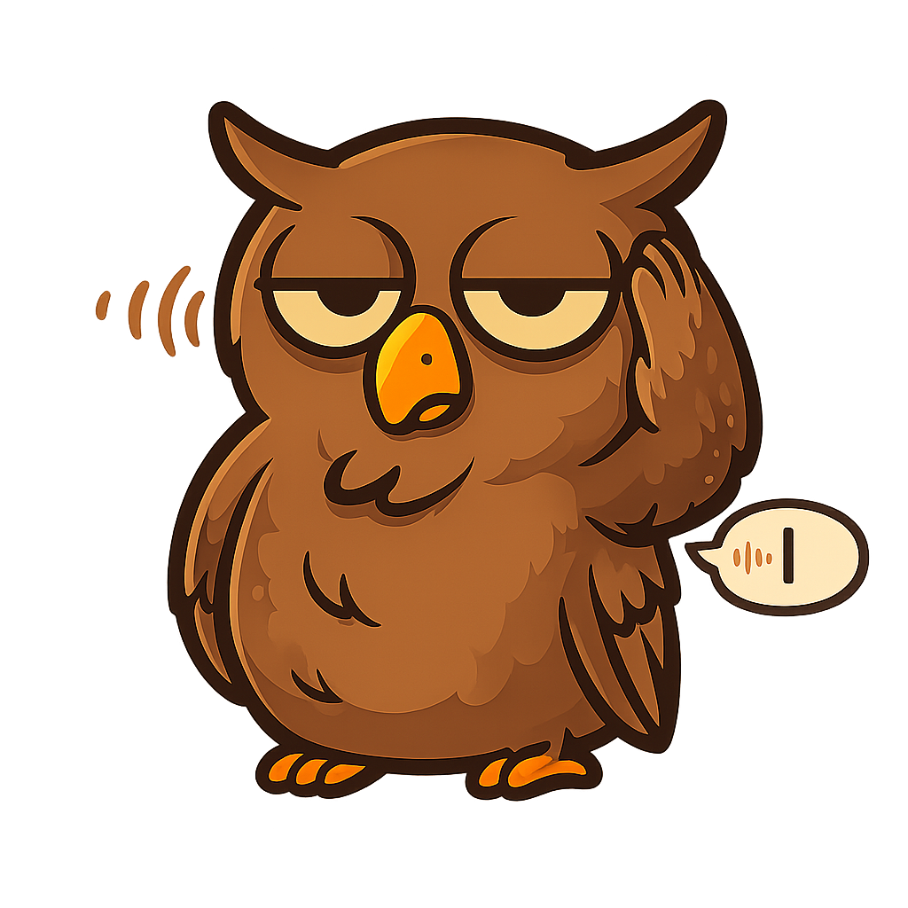

<p align="center">
  
</p>

<h1 align="center">OwlWhisper</h1>

<p align="center">
  macOS 本地语音输入工具 — 按住快捷键说话，松开后文字自动出现在光标处。
  <br>
  完全离线，无需云端 API，中文优化（FireRedASR2，2.89% CER）。
</p>

<p align="center">
  <a href="https://github.com/sanvibyfish/OwlWhisper/releases"></a>
  
  
  
</p>

<p align="center">
  <a href="../README.md">English</a> | <strong>中文</strong>
</p>

---

## 使用方式

1. 按住快捷键（默认：`Fn`）
2. 自然说话
3. 松开 — 语音自动转写并粘贴到光标处

所有处理都在本地完成，数据不会离开你的设备。

## 功能特性

- **按住说话** — 全局快捷键，任何应用内都可用，可自定义
- **离线识别** — FireRedASR2 int8，通过 sherpa-onnx C API 调用（中文 CER 2.89%）
- **自动标点** — ct-transformer 恢复逗号、句号、问号等
- **自动粘贴** — 转写文字通过模拟 `Cmd+V` 粘贴到光标位置
- **语音检测** — Silero VAD 自动裁剪静音，仅转写语音部分
- **浮窗指示** — 录音时显示声波动画，转写时显示加载动画
- **自动下载模型** — 首次启动自动下载约 1.1GB 模型，支持断点续传
- **多语言界面** — 英文（默认）+ 中文
- **更新检查** — 自动检查 GitHub Releases 新版本

## 系统要求

- macOS 13.0+
- Apple Silicon (arm64)

## 安装

### 从 Release 下载（推荐）

1. 从 [Releases](https://github.com/sanvibyfish/OwlWhisper/releases) 下载 `OwlWhisper.app.zip`
2. 解压后移动到 `/Applications`
3. 打开应用 — 首次启动自动下载模型（约 1.1GB）

### 从源码编译

```bash
git clone https://github.com/sanvibyfish/OwlWhisper.git
cd OwlWhisper
scripts/setup.sh          # 下载原生库 + 模型
open OwlWhisper/OwlWhisper.xcodeproj
# Build & Run (⌘R)
```

## 权限说明

首次启动时，OwlWhisper 会引导你授予所需权限：

| 权限 | 用途 |
|---|---|
| 麦克风 | 录制语音 |
| 辅助功能 | 模拟 `Cmd+V` 粘贴和监听全局快捷键 |

## 架构

```
OwlWhisper.app
├── ASRService.swift          # sherpa-onnx C API：VAD + ASR + 标点
├── AudioRecorder.swift       # AVAudioEngine 16kHz 单声道录音
├── HotkeyManager.swift       # CGEventTap 全局快捷键检测
├── FloatingIndicator.swift   # 声波 + 加载点动画浮窗
├── SettingsWindowController  # Auto Layout 设置窗口与引导
├── ModelDownloader.swift     # 分块并行下载，支持断点续传
├── UpdateChecker.swift       # GitHub Release 版本检查
├── MenubarController.swift   # 菜单栏图标 + 菜单
├── PasteController.swift     # CGEvent 模拟 Cmd+V
├── AppDelegate.swift         # 应用生命周期与调度
└── Frameworks/
    ├── libsherpa-onnx-c-api.dylib
    └── libonnxruntime.1.23.2.dylib
```

## 模型

首次启动时自动下载到 `~/Library/Application Support/OwlWhisper/models/`：

| 模型 | 大小 | 用途 |
|---|---|---|
| FireRedASR2 int8 | ~300MB | 中英文语音识别 |
| ct-transformer | ~270MB | 标点恢复 |
| Silero VAD | ~2MB | 语音活动检测 |

## 技术栈

- Swift 5.9，AppKit（无 SwiftUI）
- sherpa-onnx C API，通过 bridging header 调用
- onnxruntime 1.23.2

## 许可证

[GPL-3.0](../LICENSE)
